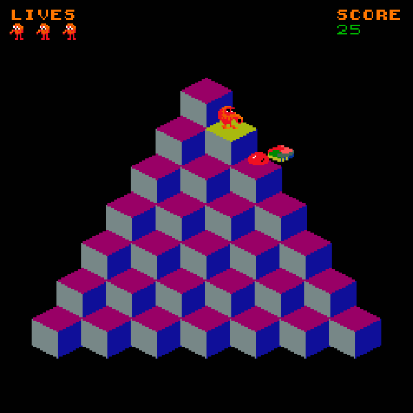
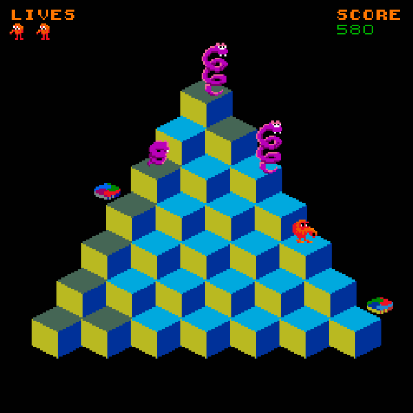

# Arcade Video Game - Q*Bert

A p5 based recreation of the classic arcade game Q*bert for the Visual Computing - 2024-2 class at Universidad Nacional de Colombia.

## Team

- David Alfonso Cañas Palomino - Saturday Group
- Juan Sebastian Sarmiento Pulido - Saturday Group
- Esteban Lopez Barreto - Saturday Group
- Sergio Sanchez Moreno - Virtual Group

## Screenshots

## How to run

We have a local minified copy of p5.js, but due to the spritesheet you would need to run this in a server, we suggest running `python -m http.server 8888` in the code root folder. Or you can visit the slightly adapted version we uploaded to the p5 web editor [here](https://editor.p5js.org/sesanchezmo/full/kyvxBr6Rc) 

## Program Structure

Some notes relevant to the implementation and program structure
- The game is drawn over a graphics buffer at the real pixel scale, then we rescale this buffer without loosing resolution.
- We use 3D coordinates for the game, then we apply an isometric projection to properly render everything in the 2D screen.
- A big chunk of the code corresponds to animations for the entities movement, we mainly use ease out and ease it for parabolic movements. 
- Almost everything on screen is rendered using sprites from the sprite sheet.
- Everything related to the core game logic is in the `QbertGame` class in `sketch.js`, there is some rendering logic there too, the classes for each entity manage some little "state machines" and animations.
- The cubes are randomly selected each time the game is loaded (you can reload the page or after loosing/winning and restarting).
- There are two types of enemies balls and snakes, balls just fall to the edge of the map, but snakes try to follow you.

## References
  
  - We use the sprite sheet submitted by user  	*Superjustinbros* at  https://www.spriters-resource.com/arcade/qbert/sheet/60496/ 